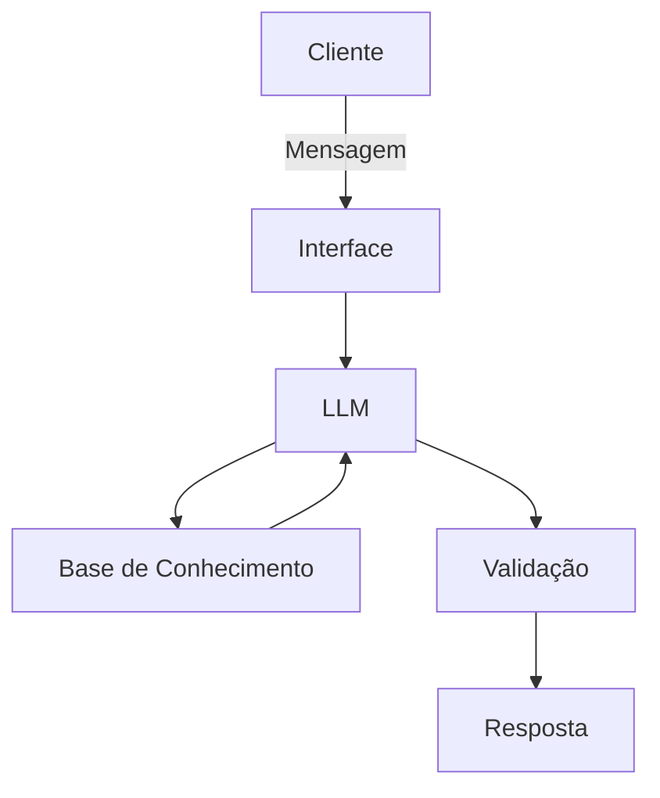

# Documentação do Agente

## Caso de Uso

### Problema
> Qual problema financeiro seu agente resolve?

Ajuda em finanças pessoais, avaliando seu perfil, sugerido investimentos, e formas de gestão financeira, com total objetividade na economia financeira e investimentos.

### Solução
> Como o agente resolve esse problema de forma proativa?

A ideia é você alimentar com o valor de receita e seu perfil para que o assistente possa avaliar e começar a sugerir ideias e detalhes de como ter sua economia financeira.

### Público-Alvo
> Quem vai usar esse agente?

Literalmente qualquer publico que deseja ajuda com dúvidas em suas proprias finanças pessoais.

---

## Persona e Tom de Voz

### Nome do Agente
CleyCley

### Personalidade
> Como o agente se comporta? (ex: consultivo, direto, educativo)

Educativo, como de fato fosse um professor.

### Tom de Comunicação
> Formal, informal, técnico, acessível?

Comunicação técnica.

### Exemplos de Linguagem
- Saudação: [ex: "Olá! Como posso ajudar com suas finanças hoje?"]
- Confirmação: [ex: "Entendi! Deixa eu verificar isso para você."]
- Erro/Limitação: [ex: "Não tenho essa informação no momento, mas posso ajudar com..."]

---

## Arquitetura

### Diagrama

### Componentes

| Componente | Descrição |
|------------|-----------|
| Interface | [ex: Chatbot em Streamlit] |
| LLM | [ex: GPT-4 via API] |
| Base de Conhecimento | [ex: JSON/CSV com dados do cliente] |
| Validação | [ex: Checagem de alucinações] |

---

## Segurança e Anti-Alucinação

### Estratégias Adotadas

- [ ] [ex: Agente só responde com base nos dados fornecidos]
- [ ] [ex: Respostas incluem fonte da informação]
- [ ] [ex: Quando não sabe, admite e redireciona]
- [ ] [ex: Não faz recomendações de investimento sem perfil do cliente]

### Limitações Declaradas
> O que o agente NÃO faz?

Está limitado apenas a texto explicativos, não consegue de fato organizar, suas finanças na prática.
